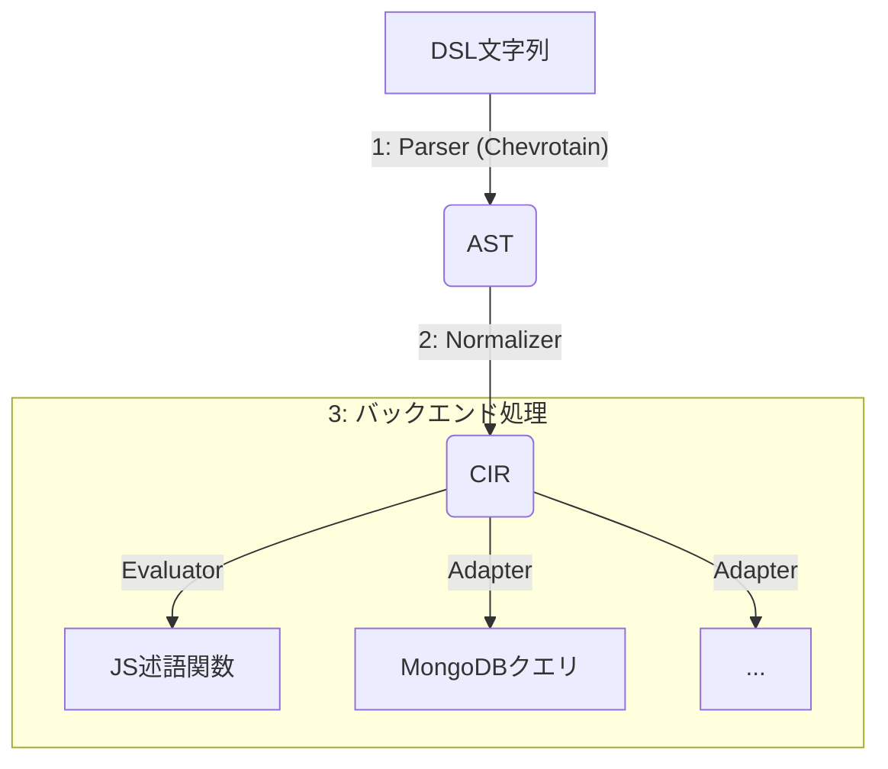

## **docs/spec/ast-cir.md**

### **1. はじめに**

このドキュメントでは、`cirquery`プロジェクトの核となる2つの中間表現、**AST (Abstract Syntax Tree)** と **CIR (Canonical Intermediate Representation)** のデータ構造を定義します。

#### 1.1 ASTとCIRの役割

-   **AST (抽象構文木)**
    -   **役割**: パーサーがDSL文字列を解析した直後の、構文構造を忠実に表現したツリーです。
    -   **特徴**: 省略形（`path:value`）や括弧の構造、演算子の優先順位などがそのまま保持されます。これにより、元のクエリとの対応が分かりやすく、デバッグや構文ハイライトなどのツール連携に適しています。

-   **CIR (正規化された中間表現)**
    -   **役割**: ASTを、後段の評価器や各種アダプタ（MongoDB, SQLなど）が解釈しやすいように正規化した、一貫性のあるツリーです。
    -   **特徴**: 省略形は展開され（例: `path:value` → `contains`）、否定（`NOT`）は可能な限り末端に押し下げられます。配列の操作も `any`/`all`/`none` に統一されます。これにより、アダプタの実装が大幅に簡素化されます。
    - **設計注記**: CIRでは Path/Literal/各ノードを「判別可能な合併型（discriminated union）」として安全に扱うため、Pathにも `type: 'Path'` を持たせます。これにより、正規化・検証（ensure系）・エラーメッセージの一貫性が向上します。

#### 1.2 全体フロー

`cirquery`ライブラリのデータ変換フローは以下のようになります。



***

### **2. AST (Abstract Syntax Tree) の型定義**

ASTは、DSLの構文要素を直接的に表現するノードで構成されます。

```typescript
// すべてのASTノードが持つ基本情報
interface AstNode {
  type: string;
  // loc?: { start: Position; end: Position }; // 将来的に位置情報を追加
}

// パス: author.name
interface PathNode extends AstNode {
  type: 'Path';
  segments: string[];
}

// リテラル: "ジン", 20, true, null
type LiteralNode = StringLiteralNode | NumberLiteralNode | BooleanLiteralNode | NullLiteralNode;

interface StringLiteralNode extends AstNode {
  type: 'StringLiteral';
  value: string;
}
interface NumberLiteralNode extends AstNode {
  type: 'NumberLiteral';
  value: number;
}
interface BooleanLiteralNode extends AstNode {
  type: 'BooleanLiteral';
  value: boolean;
}
interface NullLiteralNode extends AstNode {
  type: 'NullLiteral';
}

// 式
type Expression =
  | LogicalExpression
  | UnaryExpression
  | ComparisonExpression
  | TextShorthandExpression
  | CallExpression
  | GroupExpression
  | ValueListExpression;

// A AND B, A OR B
interface LogicalExpression extends AstNode {
  type: 'LogicalExpression';
  operator: 'AND' | 'OR';
  left: Expression;
  right: Expression;
}

// NOT A
interface UnaryExpression extends AstNode {
  type: 'UnaryExpression';
  operator: 'NOT';
  argument: Expression;
}

// alcohol_content = 40
interface ComparisonExpression extends AstNode {
  type: 'ComparisonExpression';
  operator: '=' | '!=' | '>' | '>=' | '<' | '<=';
  left: PathNode;
  right: LiteralNode;
}

// name:"ジン", alcohol_content:>20, year:20
interface TextShorthandExpression extends AstNode {
  type: 'TextShorthandExpression';
  path: PathNode;
  // : の右側。文字列、値、比較、または値リストが来る
  value: StringLiteralNode | NumberLiteralNode | ComparisonShorthand | ValueListExpression;
}

// >20 のような省略形
interface ComparisonShorthand extends AstNode {
  type: 'ComparisonShorthand';
  operator: '>' | '>=' | '<' | '<=';
  value: LiteralNode;
}

// ("ジン", "ウイスキー") または (>5, <13)
interface ValueListExpression extends AstNode {
  type: 'ValueListExpression';
  values: (StringLiteralNode | ComparisonShorthand)[];
  // 括弧内でAND/ORが使われるケース
  operator?: 'AND' | 'OR';
}

// contains(), any()
interface CallExpression extends AstNode {
  type: 'CallExpression';
  callee: string; // "contains", "any" など
  arguments: (PathNode | Expression)[];
}

// (A OR B)
interface GroupExpression extends AstNode {
  type: 'GroupExpression';
  expression: Expression;
}
```

***

### **3. CIR (Canonical Intermediate Representation) の型定義**

CIRは、正規化後のシンプルで一貫性のあるノードで構成されます。

```typescript
// すべてのCIRノードが持つ基本情報
interface CirNode {
  type: string;
}

// Path と Literal はCIRで独立定義（ASTに依存しない）
type Path = { type: 'Path'; segments: string[] };
type Literal =
  | { type: 'StringLiteral', value: string }
  | { type: 'NumberLiteral', value: number }
  | { type: 'BooleanLiteral', value: boolean }
  | { type: 'NullLiteral' };

// and/or: childrenに複数のノードを持つ
interface AndNode extends CirNode {
  type: 'And';
  children: CirNode[];
}
interface OrNode extends CirNode {
  type: 'Or';
  children: CirNode[];
}

// not: 否定。正規化後は末端の条件にのみ現れる
interface NotNode extends CirNode {
  type: 'Not';
  child: CirNode;
}

// 比較: =, !=, >, ...
interface ComparisonNode extends CirNode {
  type: 'Comparison';
  path: Path;
  op: 'eq' | 'neq' | 'gt' | 'gte' | 'lt' | 'lte';
  value: Literal;
}
//正規化注記: NOT(Comparison) はnormalizationのルールDに従い演算子反転で NotNode が除去される場合がある（例: NOT(price > 10) → price <= 10）。

// テキスト: contains, startsWith, endsWith
interface TextNode extends CirNode {
  type: 'Text';
  path: Path;
  op: 'contains' | 'startsWith' | 'endsWith';
  value: { type: 'StringLiteral', value: string };
}

// 配列作用: any, all, none
interface QuantifiedNode extends CirNode {
  type: 'Quantified';
  quantifier: 'any' | 'all' | 'none';
  path: Path; // 配列フィールドへのパス
  predicate: CirNode; // 配列要素に適用される述語（評価可能なCIR）
}
```


**設計注記**:  
- CIRのPathは `type: 'Path'` を持ちます。これは合併型判定の安定化・AST/CIR境界の明確化・正規化時のensure系（ensurePath/ensureStringLiteral/ensureCirNode）の堅牢化のための設計判断です。

- **評価オプションによる前処理**
  - `TextNode`の比較は、評価時にオプション `ignoreCase` と `foldDiacritics` の前処理を受ける。`foldDiacritics=true` の場合、文字列は比較前に NFD 正規化を行い、U+0300–U+036F の結合ダイアクリティカルマークを除去する。  
  - その後、`ignoreCase=true` の場合は `toLocaleLowerCase(locale)` を適用する。`toLocaleLowerCase` の結果はロケール依存であり、tr（トルコ語）などでは “I”→“ı” などの差異がある。


---

### 4. ASTからCIRへの変換イメージ

| DSLクエリ | AST (主要ノード) | CIR (主要ノード) |
| :--- | :--- | :--- |
| `name:"ジン"` | `TextShorthandExpression` | `TextNode` (op: 'contains', path: `{ type: 'Path', segments: ['name'] }`) |
| `ingredients.name:"ジン"` | `TextShorthandExpression` | `QuantifiedNode` (quantifier: 'any', path: `{ type: 'Path', segments: ['ingredients'] }`, predicate: `TextNode`) |
| `alcohol_content:(>5, <13)` | `TextShorthandExpression` + `ValueListExpression` | `AndNode` (children: `ComparisonNode` x 2) |
| `name:("A", "B")` | `TextShorthandExpression` + `ValueListExpression` | `OrNode` (children: `TextNode` x 2) |
| `NOT (A OR B)` | `UnaryExpression('NOT')` + `LogicalExpression('OR')` | `AndNode` (children: `NotNode(A)`, `NotNode(B)`) |

サンプル内のCIRにおける path は、すべて `{ type: 'Path', segments: [...] }` 形式に統一してください。  
**注意**:テキスト演算の照合は `Evaluator` のオプションに依存するため、CIR の構造は不変でも、評価結果は `ignoreCase` と `foldDiacritics`、`locale` の組み合わせで変化し得る。
---

### 付録: 変更履歴（抜粋）

- 2025-08: CIRのPathを `{ type: 'Path', segments: string[] }` に変更
  - 目的: 判別可能な合併型の安定化、AST/CIRの責務分離、正規化時のensure系での堅牢な型判定
  - 影響: テストの期待値（CIRサンプル）における `path` を `{ segments: [...] }` から `{ type: 'Path', segments: [...] }` に更新
- 2025-08: QuantifiedNodeの内側条件のフィールド名を inner から predicate（型: CirNode）へ統一

- 2025-08: 比較/テキスト/量化子の正規化ポリシー（別章）に合わせ、CIR定義を再確認

このドキュメントを基盤とし、次のステップとして **`docs/design/parser.md`** （パーサー実装計画書）の作成に進みます。
