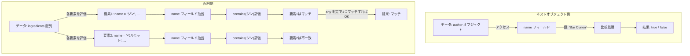

# dsl.md
## version: 0.2

## 全体構成（章立て）
1. 目的・適用範囲
2. クイックスタート（例と期待結果）
3. 文法概要（優先順位・トップレベル構造）
4. フィールドパス（識別子・クオート・予約語）
5. リテラル（文字列/数値/ブール/nullとエスケープ）
6. 比較演算（=, !=, >, >=, <, <=）
7. テキスト演算（contains/startsWith/endsWith と省略形 path:value）
8. 配列作用（any/all/none、ショートハンドと同一要素AND）
9. 複合値・複合条件（path:(...), 文字列のOR、比較のAND）
10. 論理演算（AND/OR/NOT、括弧、優先順位）
11. 正規化規則（ASTからCIRへ）
12. エラー仕様（メッセージ方針・代表ケース）
13. オプションと将来拡張（ignoreCase ほか）
14. 互換・非目標（本DSLがカバーしないもの）
15. 参考の写像例（DSLからCIRへの変換スケッチ）


***


## **第1章　目的・適用範囲**

### 1.1 目的
本DSL（Domain Specific Language）は、ネスト構造や配列を含むJSONデータに対し、自然で簡潔な構文で柔軟な検索条件を記述できるように設計されたクエリ言語です。  
**例：**
```
ingredients.name:"ジン" AND alcohol_content:>20
```
このような1行のクエリを、バックエンドに非依存な中間表現（CIR: Canonical Intermediate Representation）に変換し、様々なデータソースに対する検索を実現します。

### 1.2 背景
- 従来のJSON検索手段（例: MongoDBクエリ、Elasticsearch DSL、JMESPath 等）は強力ですが、それぞれ構文や表現が異なり学習コストが高いという課題がありました。
- Google検索のように、**人が直感的に書ける短い文字列から高機能な検索条件へ**と変換したいという需要があります。
- バックエンドに非依存な形でパースし、JavaScriptの述語関数やMongoDBクエリ等の複数ターゲットに変換できるOSSは非常に少ないのが現状です。

### 1.3 設計原則
本DSLは、開発者が容易に利用・拡張できるよう、以下の設計原則に基づいています。
- **簡潔さの優先**: Google検索のような `key:value` 形式を基本とし、一般的なユースケースを簡潔に記述できることを最優先します。
- **表現力との両立**: 複雑な条件は、省略形ではなく明示的な関数形式や括弧で記述できるようにし、可読性と表現力を両立させます。
- **直感的なデフォルト**: 配列の操作は、最も利用頻度の高い `any`（いずれかの要素が合致）を暗黙のデフォルトとします。これにより、利用者は配列を意識せず自然にクエリを記述できます。

### 1.4 適用範囲（v0.1仕様）
本仕様 v0.1 では、以下の機能をサポートします。
- **論理演算**: `AND` / `OR` / `NOT` と括弧によるグルーピング
- **比較演算**: `=`, `!=`, `>`, `>=`, `<`, `<=`
- **テキスト演算**: `contains`, `startsWith`, `endsWith` とその省略形
- **配列作用**: `any`, `all`, `none` とその省略形
- **リテラル**: 文字列・数値・真偽値・null

### 1.5 非対象（現時点での範囲外）
- 正規表現検索（将来拡張予定）
- `in` / `not in` 専用演算子（v0.2以降で検討）
- 日付型専用の比較やロケール依存の文字列比較
- 高度な全文検索（fuzzy search, scoring等）

### 1.6 用語の定義
本仕様書で用いる主要な用語を以下に定義します。
- **DSL (Domain Specific Language)**: 本仕様書で定義される、JSON検索に特化したクエリ言語。
- **AST (Abstract Syntax Tree)**: 入力されたDSLクエリの構文構造を忠実に表現したツリー構造の中間表現。
- **CIR (Canonical Intermediate Representation)**: ASTを正規化した、評価や各種アダプタへの変換に適した中間表現。省略形は展開され、否定（NOT）は可能な限り末端の条件に押し下げられます。
- **フィールドパス (Field Path)**: JSONデータ内の特定フィールドを指し示すためのドット区切りの文字列（例: `author.name`）。

***

## **第2章　クイックスタート**

この章では、詳細な文法説明に入る前に、DSLの使い方を短い例で示し、どのような結果が得られるかを直感的に理解できるようにします。

### **2.1 単純な比較**
**DSL**: `alcohol_content:>20`  
**意味**: `alcohol_content` が 20 より大きいデータを検索します。  
（詳細は **第6章** を参照）

### **2.2 部分一致検索（contains）**
**DSL**: `ingredients.name:"ジン"`  
**意味**: 材料（`ingredients`配列）のいずれかの要素で、`name` に「ジン」を含むデータを検索します。これは `any(ingredients, name contains "ジン")` として評価されます。  
（詳細は **第7章**, **第8章** を参照）

### **2.3 複数条件の組み合わせ**
**DSL**: `ingredients.name:"ジン" AND alcohol_content:>20`  
**意味**: 材料に「ジン」を含み、かつアルコール度数が20を超えるデータを検索します。  
（詳細は **第10章** を参照）

### **2.4 ネストしたOR条件**
**DSL**: `author.name="Bar Curion" AND (ingredients.type:"リキュール" OR ingredients.type:"スピリッツ")`  
**意味**: 作者が「Bar Curion」であり、かつ材料の種類が「リキュール」または「スピリッツ」であるデータを検索します。

### **2.5 同一要素内のAND**
**DSL**: `ingredients:(name:"ジン" AND type:"スピリッツ")`  
**意味**: `ingredients` 配列の **同じ要素内** で、`name` が「ジン」かつ `type` が「スピリッツ」である条件を満たすデータを検索します。  
（詳細は **第8章**, **第9章** を参照）

### **2.6 複数値のOR（フィールドに対する複数語）**
**DSL**: `ingredients.name:("ジン","ウイスキー")`  
**意味**: `name` に「ジン」または「ウイスキー」を含む材料を持つデータを検索します。これは `any(ingredients, name contains "ジン" OR name contains "ウイスキー")` と等価です。  
（詳細は **第9章** を参照）

### **2.7 数値範囲検索**
**DSL**: `alcohol_content:(>5,<13)`  
**意味**: アルコール度数が5より大きく、かつ13未満のデータを検索します。同一フィールドに対する数値比較は **AND** として解釈されます。

### **2.8 NOT条件**
**DSL**: `NOT ingredients.name:"ジン"`  
**意味**: 材料に「ジン」を一切含まないデータを検索します。

***

## **第3章　文法概要（優先順位・トップレベル構造）**

この章では、DSLの基礎的な文法構造と、演算子の優先順位を示します。以降の章で各構成要素の詳細を説明しますが、ここでは全体像を把握することを目的とします。

### **3.1 トップレベル構造**
DSLクエリは **式（Expression）** を1つ以上組み合わせたものであり、論理演算子 `AND` / `OR` / `NOT` および括弧を使って構造化します。以下に簡易的なBNF（バッカス・ナウア記法）で構造を示します。

```
<query> ::= <expr>
<expr>  ::= <orExpr>
<orExpr> ::= <andExpr> ( OR <andExpr> )*
<andExpr> ::= <notExpr> ( AND <notExpr> )*
<notExpr> ::= ( NOT <notExpr> ) | <primary>
<primary> ::= <comparison> | <textShorthand> | <quantified> | "(" <expr> ")"
```

### **3.2 演算子の優先順位**
演算子は、以下の優先順位（高い順）で適用されます。

1.  **`()`（括弧）**: 最も優先順位が高く、任意の式の評価順序を明示的に制御します。
2.  **`NOT`**: 単一の条件やグループを否定します。
3.  **`AND`**: 両方の条件が真である場合に全体を真とします。
4.  **`OR`**: いずれかの条件が真である場合に全体を真とします。

`A OR B AND C` は `A OR (B AND C)` と解釈されます。

### **3.3 トークンの区切り規則**
- **スペース/改行**: 文字列リテラル内部を除き、トークンの区切りとして機能します。連続するスペースは1つの区切りとみなされます。
- **論理演算子**: `AND` / `OR` / `NOT` は大文字小文字を区別しません（例: `and` でも可）。
- **区切り文字**: `:` はフィールドパスと値の区切りに、`,` は複合値リストの区切りに使用します。

### **3.4 文法要素の分類**
- **比較演算**: `=`, `!=`, `>`, `>=`, `<`, `<=`
- **テキスト演算**: `contains`, `startsWith`, `endsWith`
- **省略形**: `field:value`（`contains`と等価）
- **配列作用**: `any`, `all`, `none`
- **論理演算**: `AND`, `OR`, `NOT`

この章でDSLの基本構造と演算子の優先度を掴むことで、次章以降のフィールドパスやリテラルの詳細な説明が理解しやすくなります。

***

## **第4章　フィールドパス（識別子・クオート・予約語）**

この章では、JSONデータ内の特定の値を指し示す「フィールドパス」の仕様について解説します。

### **4.1 フィールドパスの役割**
フィールドパスは、検索対象となるフィールドを指定するための表記です。ドット（`.`）を使ってネストした階層を表現します。
- 例: `name`（トップレベルの `name` フィールド）
- 例: `author.name`（`author` オブジェクト内の `name` フィールド）
- 例: `ingredients.name`（`ingredients` 配列の各要素が持つ `name` フィールド）

### **4.2 基本構文**
フィールドパスは、1つ以上の「セグメント」がドットで連結されたものです。
```
<path> ::= <segment> ("." <segment>)*
<segment> ::= <identifier> | <quotedIdentifier>
```

> **注記（実装仕様）：**
> - **（例: `"field name"`）も含め、ダブルクオート囲みはLexer（Chevrotain）の都合により全て `StringLiteral` トークンで一括認識**します。
> - **Parser/Visitorでは`<path>`や`<segment>`文脈で現れた`StringLiteral`を意味的に`<quotedIdentifier>`として処理**します（`segments`の要素として格納）。値（リテラル）文脈では通常の文字列として扱われます。
> - Lexerに「QuotedIdentifier」トークン型は**実装されていません**（設計経緯はparser.md参照）。


### **4.3 識別子（Identifier）のルール**
- 英字、数字、アンダースコア(`_`)、ハイフン(`-`)の組み合わせが使用可能です。（例: `author_name`, `product-id`）
- 数字のみのセグメントも許容されます。（例: `items.0.name`）
- ドット `.` はセグメントの区切り文字とみなされるため、識別子内部には含められません。

### **4.4 クオート識別子（Quoted Identifier）**
スペース、予約語、特殊記号（`.`など）を含むフィールド名は、ダブルクオート `""` で囲む必要があります。
- 内部のダブルクオートは `\"`、バックスラッシュは `\\` でエスケープします。
- 例: `"author.name"`（ドットを含むフィールド名）、`"special key"`（スペースを含むフィールド名）

### **4.5 予約語の制約**
`AND`, `OR`, `NOT` は論理演算子として予約されています。これらをフィールド名として使用する場合は、必ずクオートで囲んでください（例: `"AND"`, `"not"`）。予約語は大文字小文字を区別せずに扱われます。

### **4.6 実用例と評価モデル**
#### 1. ネストオブジェクトのフィールド
**DSL**: `author.name="Bar Curion"`  
**意味**: `author` オブジェクトの `name` フィールドが `"Bar Curion"` と完全一致するデータを検索します。  
**対象データ例**:
```json
{
  "author": { "name": "Bar Curion", "country": "JP" }
}
```
**評価結果**: **マッチします。**

#### 2. 配列要素のフィールド（暗黙の `any`）
**DSL**: `ingredients.name:"ジン"`  
**意味**: `ingredients` 配列のいずれかの要素で、`name` フィールドに「ジン」という文字列を含むデータを検索します。  
**対象データ例**:
```json
{
  "ingredients": [
    { "name": "ジン", "amount": "30ml" },
    { "name": "ドライ・ベルモット", "amount": "10ml" }
  ]
}
```
**評価結果**: **マッチします**（1番目の要素が条件を満たすため）。

#### 3. 明示的な配列作用（`all` / `none`）
**DSL**: `all(ingredients, type="リキュール")`  
**意味**: `ingredients` 配列の **すべての要素** が `type` フィールドの値が `"リキュール"` である場合にマッチします。（詳細は **第8章** を参照）

#### 評価イメージ


> **ポイント**: 同じ `path.to.field` という書き方でも、対象フィールドがオブジェクトか配列かによって評価ロジックが異なります。本DSLでは、配列の場合は `any` を暗黙的に適用することで、利用者の記述負担を軽減しています。

***

## **第5章　リテラル（文字列 / 数値 / ブール / null とエスケープ）**

この章では、DSLにおける値（リテラル）の種類と表記方法を説明します。リテラルは、比較条件の右辺などで使用される具体的な値です。

### **5.1 リテラルの種類**
本DSLでは、JSONで表現可能な主要なデータ型に対応するリテラルをサポートします。
- **文字列** (string)
- **数値** (number)
- **真偽値** (boolean)
- **null**

### **5.2 リテラルの書式**
#### **(1) 文字列 (string)**
- ダブルクオート `""` で囲んで表現します。
- 以下のエスケープシーケンスが利用可能です: `\"` (ダブルクオート), `\\` (バックスラッシュ), `\n` (改行), `\t` (タブ), `\r` (復帰)。
- `path:value` の省略形におけるクオートなしの `value` も文字列として扱われます。
- 例: `name:"マティーニ"`, `description:"A classic cocktail\n"`

#### **(2) 数値 (number)**
- 整数、負数、小数、および指数表記（`e`または`E`）をサポートします。
- 例: `alcohol_content=40`, `price=-2.5`, `tolerance=1e-5`

#### **(3) 真偽値 (boolean)**
- 小文字の `true` または `false` で表現します。これらは予約語として扱われます。
- 例: `is_available=true`

#### **(4) null**
- 小文字の `null` で表現します。これも予約語として扱われます。
- 例: `notes=null`

### **5.3 型判別の優先度**
パーサーが値を解釈する際の型判別は、以下の優先順位で行われます。
1.  **予約語**: `true`, `false`, `null` は最優先でそれぞれの型として解釈されます。
2.  **数値**: 予約語でなく、数値として有効な形式の場合、数値型として扱われます。
3.  **文字列**: 上記以外の場合、またはダブルクオートで明示的に囲まれている場合は、文字列型として扱われます。

### **5.4 型と演算子の組み合わせ**
リテラルの型によって、使用できる演算子が異なります。型が一致しない比較は、エラーにはなりませんが評価時に常に `false` となります。

| リテラル型 | 使用可能な演算子 | 備考 |
| :--- | :--- | :--- |
| **数値** | `=`, `!=`, `>`, `>=`, `<`, `<=` | テキスト演算（`contains`等）は使用できません。 |
| **文字列** | `=`, `!=`, `contains`, `startsWith`, `endsWith`, 省略形`:` | `=`は完全一致、`:`は部分一致です。大小比較はv0.1では非対応です。 |
| **真偽値** | `=`, `!=` | |
| **null** | `=`, `!=` | |

**型不一致の例**: クエリ `alcohol_content:"20"` は構文上有効ですが、`alcohol_content` フィールドが数値型の場合、文字列 `"20"` との比較は常に `false` となります。正しくは `alcohol_content=20` です。

***

## **第6章 比較演算（=, !=, >, >=, <, <=）**

この章では、フィールドの値とリテラルを比較するための演算子について詳述します。

### **6.1 概要**
比較演算は、フィールドの値を特定の値と等しいか、大小関係にあるかなどを評価するために用います。数値、文字列、真偽値、nullに対して使用できますが、型によって利用可能な演算子が異なります（**第5章 5.4**参照）。

### **6.2 構文**
比較演算には、演算子を明示する標準的な形式と、コロン `:` を用いた省略形があります。

- **標準形**: `フィールドパス 演算子 値`
  - 例: `alcohol_content > 20`
  - 例: `author.name = "Bar Curion"`
- **省略形**: `フィールドパス:演算子値`
  - 例: `alcohol_content:>20`
  - 例: `author.name:="Bar Curion"`

どちらの形式も等価ですが、省略形はより簡潔に記述できます。演算子と値の間にスペースは不要です。

### **6.3 型に応じた挙動**
- **数値**: すべての比較演算子（`=`, `!=`, `>`, `>=`, `<`, `<=`）が利用可能です。複数の比較を組み合わせることで範囲指定ができます（**第9章**参照）。
- **文字列**: `=` は **完全一致**、`!=` は **完全不一致** を評価します。v0.1では大小比較（`>`, `<` 等）には対応していません。部分一致検索はテキスト演算（**第7章**）を使用します。
- **真偽値・null**: `=` と `!=` のみ利用可能です。

### **6.4 具体例**
#### **数値の比較**
**DSL**: `price <= 1000`  
**意味**: `price` フィールドの値が `1000` 以下であるデータを検索します。  
**対象データ例**:
```json
{ "name": "Standard Drink", "price": 800 }
```
**評価結果**: **マッチします。**

#### **文字列の完全一致**
**DSL**: `category = "スピリッツ"`  
**意味**: `category` フィールドの値が `"スピリッツ"` という文字列と完全に一致するデータを検索します。  
**対象データ例**:
```json
{ "name": "ジン", "category": "スピリッツ" }
```
**評価結果**: **マッチします。**
```json
{ "name": "ジン", "category": "スピリッツ類" }
```
**評価結果**: **マッチしません**（完全一致ではないため）。

#### **nullの判定**
**DSL**: `imageUrl != null`  
**意味**: `imageUrl` フィールドの値が `null` ではない（つまり何らかの値が設定されている）データを検索します。  

### **6.5 注意点**
- **型不一致**: `price > "high"` のような、フィールドの型とリテラルの型が異なる比較は、構文エラーにはなりませんが、評価結果は常に `false` となります。
- **演算子とスペース**: `alcohol_content > 20` と `alcohol_content>20` は等価です。可読性の観点から、演算子の前後にスペースを入れることを推奨します。

この章で解説した比較演算は、DSLの最も基本的な構成要素の一つです。次の章では、文字列に特化したテキスト演算について説明します。

***

## **第7章 テキスト演算（contains / startsWith / endsWith と省略形 path:value）**

この章では、文字列フィールドに対する部分一致、前方一致、後方一致検索を行うためのテキスト演算について説明します。

### **7.1 概要**
テキスト演算は、文字列の完全一致よりも柔軟な検索を実現します。v0.1では `contains`, `startsWith`, `endsWith` の3つの演算をサポートします。最も頻繁に利用される `contains` には、便利な省略形が用意されています。

### **7.2 構文**
テキスト演算には、関数形式と省略形があります。

- **関数形式**:
  - `contains(フィールドパス, "検索文字列")`
  - `startsWith(フィールドパス, "検索文字列")`
  - `endsWith(フィールドパス, "検索文字列")`
- **省略形（`contains` のみ）**:
  - `フィールドパス:"検索文字列"`

省略形 `name:"ジン"` は、関数形式 `contains(name, "ジン")` と完全に等価であり、記述の簡潔さからこちらの利用を推奨します。

### **7.3 挙動と評価規則**
- **`contains`**: フィールド値に、指定した検索文字列が**含まれる**場合に真となります。
- **`startsWith`**: フィールド値が、指定した検索文字列で**始まる**場合に真となります。
- **`endsWith`**: フィールド値が、指定した検索文字列で**終わる**場合に真となります。
- **大文字小文字の区別**: デフォルトでは大文字と小文字を区別します（例: `contains(name, "Gin")` は `"ジン"` にはマッチしません）。将来的に `ignoreCase` オプションでこの挙動を変更可能にする予定です（**第13章**参照）。
- **非文字列型への適用**: 対象フィールドが文字列でない場合（数値、null等）、テキスト演算の評価結果は常に `false` となります。

### **7.4 具体例**
#### **部分一致（省略形）**
**DSL**: `name:"マティーニ"`  
**意味**: `name` フィールドに「マティーニ」という文字列を含むデータを検索します。  
**対象データ例**:
```json
{ "name": "ドライ・マティーニ" }
```
**評価結果**: **マッチします。**

#### **前方一致**
**DSL**: `startsWith(name, "ドライ")`  
**意味**: `name` フィールドが「ドライ」で始まるデータを検索します。  
**対象データ例**:
```json
{ "name": "ドライ・ジン" }
```
**評価結果**: **マッチします。**
```json
{ "name": "ゴードン・ドライ・ジン" }
```
**評価結果**: **マッチしません**（前方一致ではないため）。

#### **後方一致**
**DSL**: `endsWith(garnish.name, "ピール")`  
**意味**: `garnish` 配列のいずれかの要素で、`name` フィールドが「ピール」で終わるデータを検索します。  
**対象データ例**:
```json
{
  "garnish": [{ "name": "レモンピール" }]
}
```
**評価結果**: **マッチします。**

### **7.5 完全一致（`=`）との違い**
`=` 演算子は文字列全体が完全に一致する場合にのみ真となりますが、テキスト演算は部分的な一致を許容します。
- `name = "ジン"`: `"ジン"` にのみマッチ。
- `name:"ジン"` (`contains`): `"ジン"`, `"ドライ・ジン"`, `"ジン・トニック"` などにマッチ。

用途に応じて適切に使い分けることが重要です。

***

## **第8章 配列作用（any/all/none、ショートハンドと同一要素AND）**

この章では、配列フィールド内の要素をどのように評価するかを制御する「量化子（Quantifier）」について説明します。

### **8.1 概要**
JSONデータでは、一つのキーに対して複数の値を配列として持つことがよくあります。本DSLでは、配列の要素に対して「いずれか一つでも」「すべてが」「いずれも～ない」といった条件を指定するための `any`, `all`, `none` の3つの量化子を提供します。

### **8.2 量化子の種類と意味**
- **`any(path, condition)`**: 配列 `path` の要素のうち、**1つでも** `condition` を満たすものがあれば真となります。
- **`all(path, condition)`**: 配列 `path` の **すべての要素** が `condition` を満たす場合に真となります。
- **`none(path, condition)`**: 配列 `path` の **どの要素も** `condition` を満たさない場合に真となります。

### **8.3 ショートハンド（暗黙の `any`）**
配列フィールドに対して直接条件を記述した場合、自動的に `any` が適用されます。これは最も一般的なユースケースを簡潔に記述するための仕様です。
- **DSL**: `ingredients.name:"ジン"`
- **解釈**: `any(ingredients, contains(name, "ジン"))`

### **8.4 同一要素内AND**
配列の **同じ要素内**で複数の条件を同時に満たす必要がある場合、配列名の直後で条件を `()` でグルーピングします。
- **DSL**: `ingredients:(name:"ジン" AND type:"スピリッツ")`
- **意味**: `ingredients` 配列内に、`name` に「ジン」を含み、**かつ** `type` が「スピリッツ」である、という2つの条件を**同時に満たす要素**が1つ以上存在する場合に真となります。
- **対象データ例**:
  ```json
  // マッチする例
  {
    "ingredients": [
      { "name": "ドライ・ジン", "type": "スピリッツ" }, // この要素が条件を満たす
      { "name": "トニックウォーター", "type": "ソフトドリンク" }
    ]
  }
  // マッチしない例
  {
    "ingredients": [
      { "name": "ドライ・ジン", "type": "その他" },    // typeが違う
      { "name": "ベルモット", "type": "スピリッツ" }      // nameが違う
    ]
  }
  ```

### **8.5 具体例**
#### **`all` の使用例**
**DSL**: `all(ingredients, amount_ml > 0)`  
**意味**: `ingredients` 配列の **すべての要素** で `amount_ml` フィールドが `0` より大きい場合にマッチします。

#### **`none` の使用例**
**DSL**: `none(ingredients, name:"砂糖")`  
**意味**: `ingredients` 配列の **どの要素** の `name` にも「砂糖」が含まれていない場合にマッチします。これは `NOT ingredients.name:"砂糖"` と等価です。

### **8.6 空配列の扱い**
v0.1仕様では、対象の配列フィールドが存在しない、または空配列である場合の挙動を以下のように定めます。
- `any(path, condition)`: `false`（条件を満たす要素が一つもないため）
- `all(path, condition)`: `true`（条件を破る要素が存在しないため。「空虚な真」）
- `none(path, condition)`: `true`（条件を満たす要素が一つもないため）

この章で説明した量化子は、配列を持つデータ構造に対して柔軟なクエリを可能にするための強力な機能です。

***

## **第9章 複合値・複合条件（path:(...), 文字列のOR、比較のAND）**

この章では、同じフィールドに対して複数の値や条件をまとめて記述するための構文について解説します。

### **9.1 概要**
`field:("A", "B")` や `field:(>10, <20)` のように、フィールド名の直後の `()` 内に複数の値や比較条件を記述することで、クエリを簡潔に表現できます。この構文の挙動は、対象となる値の型によって異なります。

### **9.2 文字列の複数指定（暗黙のOR）**
複数の文字列をカンマ区切りでリストした場合、それらは **`OR`** 条件として解釈されます。
- **DSL**: `name:("マティーニ", "マンハッタン")`
- **意味**: `name` フィールドに「マティーニ」を含む、**または**「マンハッタン」を含むデータを検索します。
- **解釈**: `name:"マティーニ" OR name:"マンハッタン"`

### **9.3 数値比較の複数指定（暗黙のAND）**
複数の比較条件をカンマ区切りでリストした場合、それらは **`AND`** 条件として解釈されます。これは数値の範囲指定を簡潔に記述するために非常に便利です。
- **DSL**: `alcohol_content:(>5, <13)`
- **意味**: `alcohol_content` が5より大きく、**かつ** 13未満であるデータを検索します。
- **解釈**: `alcohol_content > 5 AND alcohol_content < 13`

### **9.4 AND/ORの明示**
括弧内では、`AND` や `OR` を明示的に使用することも可能です。これにより、デフォルトの挙動を上書きできます。
- **文字列のAND**: `description:("ドライ" AND "ジン")`
  - 意味: `description` に「ドライ」と「ジン」の両方を含むデータを検索。
- **数値のOR**: `price:(<500 OR >=2000)`
  - 意味: `price` が500未満、または2000以上のデータを検索。

### **9.5 配列フィールドとの組み合わせ**
この複合条件の構文は、配列フィールドに対しても有効です。暗黙の `any` と組み合わさって機能します。

#### **要素横断OR（デフォルト）**
**DSL**: `ingredients.name:("ジン", "ウイスキー")`
**意味**: 材料に「ジン」を含むか、または「ウイスキー」を含む要素があればマッチします。
**解釈**: `any(ingredients, name:"ジン" OR name:"ウイスキー")`

#### **要素横断AND**
**DSL**: `ingredients.name:("ジン" AND "ウイスキー")`
**意味**: 材料に「ジン」を含む要素があり、**かつ**「ウイスキー」を含む要素がある場合にマッチします。これらは**別々の要素であっても構いません**。
**解釈**: `ingredients.name:"ジン" AND ingredients.name:"ウイスキー"`

> **注意**: この書き方 (`ingredients.name:("A" AND "B")`) は、**同一要素内AND**（**第8章 8.4**参照）とは意味が異なります。同一の材料が「ジン」でありかつ「ウイスキー」である、という条件を意図する場合は `ingredients:(name:"ジン" AND name:"ウイスキー")` のように記述する必要があります。

### **9.6 エラーケース**
- **型の混在**: `path:("A", >5)` のように、文字列と数値を一つのリストに混在させることはできません。これは構文エラーとなります。
- **空のリスト**: `path:()` のように、括弧内が空の場合は構文エラーとなります。

***

## **第10章 論理演算（AND/OR/NOT、括弧、優先順位）**

この章では、複数の条件を組み合わせてより複雑な検索クエリを構築するための論理演算子について説明します。

### **10.1 概要**
本DSLは、`AND`, `OR`, `NOT` の3つの基本的な論理演算子と、評価順序を制御するための括弧 `()` をサポートします。これらの演算子は、大文字小文字を区別しません（例: `and`, `or`, `not` でも可）。

### **10.2 演算子の優先順位と結合規則**
演算子の評価は、以下の優先順位（高い順）で行われます。
1.  **`()` (括弧)**: 評価順序を明示的に制御します。
2.  **`NOT`**: 条件を否定します。
3.  **`AND`**: 条件を論理積で結合します。
4.  **`OR`**: 条件を論理和で結合します。

`AND` と `OR` は左結合です。つまり、`A OR B OR C` は `(A OR B) OR C` として評価されます。

### **10.3 具体例**
#### **AND: 条件の組み合わせ**
**DSL**: `ingredients.name:"ジン" AND alcohol_content:>20`  
**意味**: 材料に「ジン」を含み、かつアルコール度数が20を超えるデータを検索します。

#### **OR: 条件の選択**
**DSL**: `author.name="Bar Curion" OR author.name="Guest"`  
**意味**: 作者が "Bar Curion" であるか、または "Guest" であるデータを検索します。

#### **NOT: 条件の否定**
**DSL**: `NOT ingredients.name:"砂糖"`  
**意味**: 材料に「砂糖」を一切含まないデータを検索します。これは `none(ingredients, name:"砂糖")` と等価です。

#### **括弧によるグルーピング**
**DSL**: `(name:"マティーニ" OR name:"マンハッタン") AND alcohol_content:>30`  
**意味**: 名前が「マティーニ」または「マンハッタン」のいずれかであり、かつアルコール度数が30を超えるデータを検索します。括弧がない場合、`AND`が優先されて意図しない結果になる可能性があります。

### **10.4 NOTと量化子の関係**
`NOT` 演算子は、配列量化子と組み合わせると、意味的に等価な別の量化子に変換されます。この変換は正規化の過程で自動的に行われます（**第11章**参照）。
- `NOT any(P, X)` は `none(P, X)` と等価です。
- `NOT all(P, X)` は `any(P, NOT X)` と等価です（「すべてがXである」の否定は「Xでないものが一つでもある」）。
- `NOT none(P, X)` は `any(P, X)` と等価です（「Xであるものが一つもない」の否定は「Xであるものが一つでもある」）。

### **10.5 エッジケースと注意点**
- **演算子の連続**: `A AND AND B` のような、二項演算子の連続は構文エラーです。
- **不完全な式**: `AND A` や `A OR` のように、演算子の片側が欠けている式は構文エラーです。
- **多重否定**: `NOT NOT A` は `A` と等価であり、正規化段階で簡約されます。

***

## **第11章 正規化規則（ASTからCIRへ）**

> **注意**: この章は、DSLパーサーやアダプタの実装者向けの技術的な詳細を記述しています。DSLの利用者の方は、この章を読み飛ばしても問題ありません。

### **11.1 目的**
パース直後のAST（抽象構文木）には、省略形や多様な否定の表現などが含まれており、そのままでは扱いにくい場合があります。そこで、ASTを評価やアダプタ変換に適した一貫性のある中間表現（CIR: Canonical Intermediate Representation）に変換します。この変換プロセスを「正規化」と呼びます。

### **11.2 正規化の主要なルール**
#### **ルールA: 省略形の展開**
- テキスト省略形は、`text` 演算に展開します。
  - `path:"text"` → `text(contains, path, "text")`
- コロン付き比較演算は、`cmp` 演算に展開します。
  - `path:>10` → `cmp(gt, path, 10)`
- 配列ショートハンドは、`quantified` 演算に明示的に展開します。
  - `ingredients.name:"ジン"` → `quantified(any, ingredients, text(contains, name, "ジン"))`

#### **ルールB: NOTの押し下げ（否定正規形）**
`NOT` 演算子を可能な限りツリーの末端に移動させ、評価を単純化します。
- **ド・モルガンの法則の適用**:
  - `NOT (A AND B)` → `(NOT A) OR (NOT B)`
  - `NOT (A OR B)` → `(NOT A) AND (NOT B)`
- **量化子の変換**:
  - `NOT any(P, X)` → `none(P, X)`
  - `NOT all(P, X)` → `any(P, NOT X)`

#### **ルールC: 複合値リストの展開**
- 文字列リストは `OR` に展開します。
  - `path:("A", "B")` → `or(text(contains, path, "A"), text(contains, path, "B"))`
- 数値比較リストは `AND` に展開します。
  - `path:(>5, <13)` → `and(cmp(gt, path, 5), cmp(lt, path, 13))`

#### **ルールD: 配列境界の明示**
- **同一要素内AND**: `ingredients:(name:"ジン" AND type:"スピリッツ")`
  - → `quantified(any, ingredients, and(text(contains, name, "ジン"), cmp(eq, type, "スピリッツ")))`
- **要素横断AND**: `ingredients.name:("ジン" AND "ウイスキー")`
  - → `and(quantified(any, ingredients, text(contains, name, "ジン")), quantified(any, ingredients, text(contains, name, "ウイスキー")))`

この正規化により、後段の評価器や各種DBアダプタは、よりシンプルで一貫性のあるCIRを前提として実装できるようになります。

***

## **第12章 エラー仕様（メッセージ方針・代表ケース）**

この章では、ユーザーが無効なクエリを入力した際に表示されるエラーメッセージの方針と、代表的なエラーケースについて説明します。

### **12.1 エラーメッセージの基本方針**
開発者がクエリを容易に修正できるよう、エラーメッセージは以下の要素を含むことを目指します。
- **位置情報**: エラーが発生した行・列番号。
- **エラー内容**: 何が問題であるかの簡潔な説明（例: `閉じ括弧 ')' が見つかりません`）。
- **コンテキスト**: エラー箇所の周辺コードのスニペット。
- **修正提案**: 可能であれば、正しい構文の例を提示（例: `予約語をフィールド名として使用する場合は "AND" のようにクオートで囲ってください`）。

### **12.2 代表的な構文エラー**
- **括弧の不整合**: `(name:"A" OR name:"B"`
  - → `エラー: 閉じ括弧 ')' が必要です。`
- **演算子の連続**: `A AND AND B`
  - → `エラー: 演算子 'AND' の後に予期しないトークン 'AND' があります。式が必要です。`
- **不完全な式**: `A OR`
  - → `エラー: クエリの末尾に予期しない演算子 'OR' があります。`
- **空の値リスト**: `path:()`
  - → `エラー: 値リスト '()' を空にすることはできません。`
- **値のない比較**: `price:>`
  - → `エラー: 比較演算子 '>' の後に値が必要です。`

### **12.3 型・組み合わせに関するエラー**
- **値リスト内の型混在**: `path:("A", >5)`
  - → `エラー: 値リスト内で型を混在させることはできません（文字列と数値比較）。`
- **予約語の誤用**: `AND.name:"x"`
  - → `エラー: 予約語 'AND' はフィールド名として直接使用できません。代わりに '"AND"' のようにクオートしてください。`
- **非対応の演算**: `price:contains("100")`
  - → `エラー: 数値型のフィールドにテキスト演算 'contains' は使用できません。`

### **12.4 ガイド付きエラーメッセージ**
一部の曖昧な構文については、より親切なガイドを提供します。
- **例**: `ingredients.name:("ジン" AND "ウイスキー")`
  - → `警告: この構文は、別々の材料で条件が満たされてもマッチします。もし「同一の材料」が両方の条件を満たすことを意図している場合は、'ingredients:(name:"ジン" AND name:"ウイスキー")' を使用してください。`

適切なエラー報告は、DSLのユーザビリティを大きく向上させる重要な要素です。

***

## **第13章 オプションと将来拡張**

この章では、v0.1で導入可能な実装オプションと、v0.2以降で検討される拡張項目について整理します。

### **13.1 実装オプション（v0.1）**
パーサーや評価器に渡すことで、挙動を調整できるオプションです。
- **`ignoreCase` (boolean)**
  - **役割**: `true`に設定すると、文字列比較（`=`）およびテキスト演算（`contains`等）で大文字と小文字を区別しなくなります。
  - **デフォルト**: `false`（区別する）
- **`locale` (string)**
  - **役割**: エラーメッセージの言語を切り替えます。
  - **指定**: `"ja"`, `"en"` など。
  - **デフォルト**: `"ja"`

### **13.2 将来拡張（v0.2以降の候補）**
- **`in` / `not in` 演算子**:
  - `field in ("A", "B", "C")` のようなSQLライクな構文。既存の `field:("A", "B", "C")` の糖衣構文（シンタックスシュガー）として導入を検討します。
- **正規表現マッチ**:
  - `name ~ /^ドライ/` のような演算子を導入。ReDoS（正規表現によるサービス拒否）攻撃への対策を講じた上での限定的な提供を検討します。
- **日付/時刻型のサポート**:
  - `created_at >= "2025-01-01T00:00:00Z"` のようなクエリを、ISO 8601形式の文字列を日付として解釈して比較する機能。
- **ワイルドカード**:
  - `name:"ドライ*"` を `startsWith(name, "ドライ")` と解釈するような、より直感的な省略形。
- **スキーマ連携**:
  - JSON Schemaなどを提供することで、パーサーがフィールドの型（数値か文字列かなど）を事前に認識し、より厳密な型チェックや補完を行う機能。

### **13.3 互換性方針**
- **後方互換性の維持**: 新機能を追加する際、既存のクエリの解釈が変わらないように最大限配慮します。破壊的変更はメジャーバージョンアップ時にのみ行います。
- **デフォルト動作の安定**: `ignoreCase` のデフォルト値など、基本的な挙動は将来のバージョンでも維持します。

***

## **第14章 互換・非目標（本DSLがカバーしないもの）**

この章では、本DSLが意図的にカバーしない範囲（非目標）を明確にすることで、利用者が技術選定を行う際の判断材料を提供します。

### **14.1 非目標（v0.1でカバーしない領域）**
- **フルスペックの全文検索**:
  - 複雑なスコアリング、ランキング、形態素解析などは対象外です。本DSLは、主に構造化されたJSONデータに対するブールフィルタリング（条件に合致するか否か）に焦点を当てます。
- **SQLの`JOIN`やサブクエリに相当する機能**:
  - 複数のデータソースをまたがるような複雑な結合操作はサポートしません。そのような処理は、本DSLが適用される前段のデータ準備層、または後段のアプリケーション層の責務とします。
- **高度な型推論**:
  - フィールドの値から型を動的に推論する機能は持ちません。比較や演算は、取得した値の型に依存して実行時に評価されます。
- **言語依存の文字列照合（Collation）**:
  - 全角/半角の区別、濁点/半濁点の有無を無視するような、日本語特有の高度な文字列比較はサポートしません。

### **14.2 他の仕様との関係**
- **JMESPath, RSQL/FIQL等**: これらの既存仕様との直接的な互換性は目標としません。本DSLは、より直感的で学習コストの低い構文を提供することに重点を置いています。
- **各種データベースへの変換**: 本DSLからMongoDBクエリやSQLの`WHERE`句への変換は、コアライブラリではなく、独立した「アダプタ」として提供されることを想定しています。これにより、コア仕様をクリーンに保ちます。

### **14.3 セキュリティに関する責務**
- **リソース制限**: クエリの実行時間上限（タイムアウト）や、メモリ使用量の制限は、本DSLのライブラリを呼び出す実行環境側の責務とします。
- **インジェクション対策**: 各種データベースへのアダプタは、生成するクエリが安全であることを保証する必要があります（例: パラメータ化クエリの使用）。

***

## **第15章 参考の写像例（DSLからCIRへの変換スケッチ）**

> **注意**: この章は、実装者向けの参考情報です。DSLが内部的にどのように正規化されるかの具体例を示します。

### **15.1 目的**
代表的なDSLクエリが、正規化された中間表現（CIR）にどのように変換されるかを示すことで、アダプタ開発などの参考に資することを目的とします。

### **15.2 例1：配列ショートハンド＋数値比較**
**DSL**: `ingredients.name:"ジン" AND alcohol_content:>20`  
**CIRスケッチ**:
```json
{
  "type": "and",
  "children": [
    {
      "type": "quantified", "quantifier": "any", "path": ["ingredients"],
      "inner": { "type": "text", "op": "contains", "path": ["name"], "value": "ジン" }
    },
    { "type": "cmp", "op": "gt", "path": ["alcohol_content"], "value": 20 }
  ]
}
```

### **15.3 例2：同一要素内AND**
**DSL**: `ingredients:(name:"ジン" AND type:"スピリッツ")`  
**CIRスケッチ**:
```json
{
  "type": "quantified", "quantifier": "any", "path": ["ingredients"],
  "inner": {
    "type": "and",
    "children": [
      { "type": "text", "op": "contains", "path": ["name"], "value": "ジン" },
      { "type": "cmp", "op": "eq", "path": ["type"], "value": "スピリッツ" }
    ]
  }
}
```

### **15.4 例3：複数値のOR**
**DSL**: `ingredients.name:("ジン","ウイスキー")`  
**CIRスケッチ**:
```json
{
  "type": "quantified", "quantifier": "any", "path": ["ingredients"],
  "inner": {
    "type": "or",
    "children": [
      { "type": "text", "op": "contains", "path": ["name"], "value": "ジン" },
      { "type": "text", "op": "contains", "path": ["name"], "value": "ウイスキー" }
    ]
  }
}
```

### **15.5 例4：NOTの押し下げ**
**DSL**: `NOT (name:"マティーニ" OR alcohol_content < 10)`  
**CIRスケッチ (正規化後)**:
```json
{
  "type": "and",
  "children": [
    { "type": "not", "child": { "type": "text", "op": "contains", "path": ["name"], "value": "マティーニ" } },
    { "type": "cmp", "op": "gte", "path": ["alcohol_content"], "value": 10 }
  ]
}
```
> **解説**: `NOT`が分配され、`OR`は`AND`に、`<`は`>=`に反転しています。